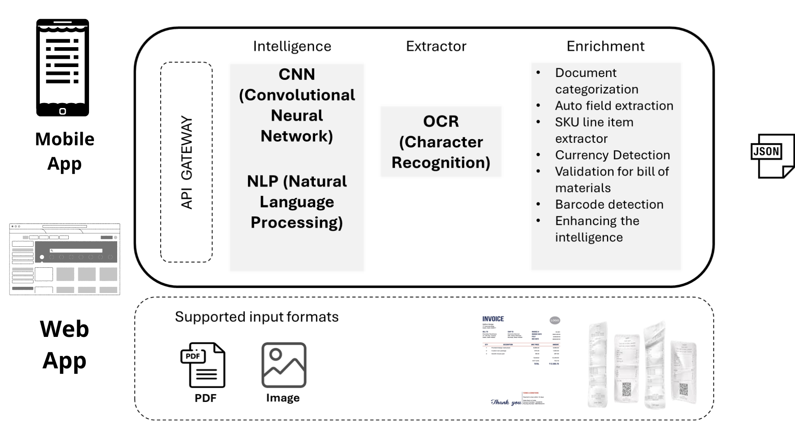

# Architecture



The architecture of the invoice text extraction solution involves the integration of YOLO (You Only Look Once), Tesseract, and NLP-based category classification. This combination of technologies enables efficient extraction of text from invoices and automated categorization. Let's explore the architecture in more detail:

#### 1. YOLO-based Object Detection:

The architecture begins with YOLO, an advanced object detection algorithm. YOLO is trained on a dataset of labeled invoice images to identify and localize regions of interest within each invoice. It detects key elements such as company names, dates, amounts, and item descriptions. YOLO utilizes deep learning techniques, employing convolutional neural networks (CNN) to perform fast and accurate object detection.

#### 2. Tesseract-based OCR:

Once YOLO has identified the regions of interest, Tesseract comes into play for optical character recognition (OCR). Tesseract is a robust open-source OCR engine that is capable of converting the textual information within the identified regions into machine-readable text. It supports a wide range of languages and provides high accuracy in text recognition. Tesseract ensures the extraction of accurate and reliable text data from the invoice regions.

#### 3. NLP-based Category Classification:

In addition to text extraction, the architecture incorporates NLP techniques for automated category classification. NLP models are trained on labeled invoice data, associating each invoice with its respective category. The NLP models learn patterns and features within the textual content of invoices, enabling them to predict the category of unseen invoices. Common NLP algorithms, such as Naive Bayes, Support Vector Machines (SVM), or deep learning models like Recurrent Neural Networks (RNN) or Transformers, can be employed for category classification.

#### 4. Pre-processing and Post-processing:

The architecture also involves pre-processing and post-processing stages to optimize the accuracy and quality of the extracted data. Pre-processing techniques may include image enhancement, deskewing, noise reduction, and resizing. These steps aim to improve the quality of the invoice images before passing them to Tesseract for OCR. Post-processing techniques, such as spell-checking, context-based corrections, and data validation, refine the extracted text and ensure its accuracy, consistency, and adherence to predefined patterns or rules.

\

<figure><figcaption></figcaption></figure>
