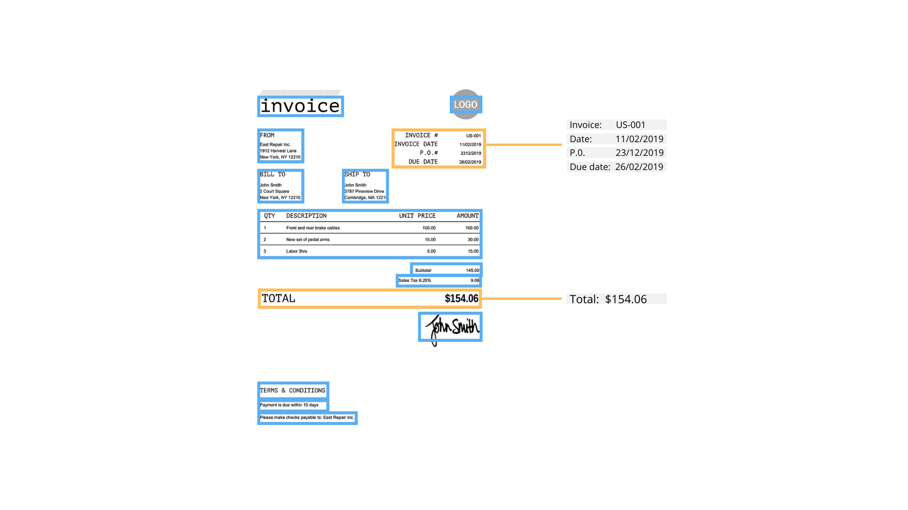

# Introduction

In today's digital age, businesses often face the challenge of efficiently extracting valuable information from invoices for various purposes, such as accounting, inventory management, and data analysis. Manually extracting this data can be time-consuming, error-prone, and hinder productivity. To overcome these challenges, the combination of YOLO (You Only Look Once) and Tesseract emerges as a powerful solution for invoice text extraction.

YOLO, an advanced object detection algorithm, has gained significant popularity for its ability to detect objects in real-time with impressive accuracy. By training YOLO on invoice datasets, it can be empowered to recognize and locate key regions of interest on an invoice, such as company names, dates, amounts, address and item descriptions. This capability opens doors to automating the extraction of relevant text from invoices efficiently.

Complementing YOLO, Tesseract serves as a robust open-source optical character recognition (OCR) engine. With its extensive language support and high accuracy in text recognition, Tesseract plays a vital role in extracting textual information from invoice images, including scanned documents. By integrating YOLO's object detection output with Tesseract's OCR capabilities, businesses can achieve end-to-end invoice text extraction, revolutionizing their document processing workflows.

The seamless integration of YOLO and Tesseract offers numerous advantages for invoice text extraction. It enables businesses to automate the extraction process, significantly reducing the time and effort required to gather crucial information from invoices. This automation enhances efficiency, eliminates manual errors, and frees up resources for more value-added tasks.

Moreover, the combination of YOLO and Tesseract can handle a variety of invoice layouts, accommodating the diverse formats used by different vendors and organizations. It empowers businesses to process invoices from multiple sources efficiently, ensuring consistency and accuracy in data extraction across various invoice types.

In this document, we will delve into the intricacies of leveraging YOLO and Tesseract for invoice text extraction. We will explore the benefits of this powerful combination and guide you through the process of implementing it effectively. From understanding YOLO's object detection capabilities and Tesseract's OCR prowess to preparing the dataset, training the models, and refining the results, this blog will provide a comprehensive overview of how to harness these technologies for streamlined invoice text extraction.

By adopting YOLO and Tesseract for invoice text extraction, businesses can unlock the potential for automation, improve data accuracy, and enhance operational efficiency. Join us on this journey as we explore the remarkable synergy of YOLO and Tesseract and discover how it can revolutionize your invoice processing workflows.

<figure><figcaption></figcaption></figure>
